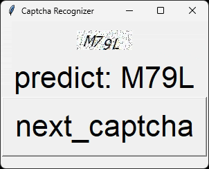

# Ncyu Captcha Recognition

## Demo Gif

## What is this?

NCYU recently(2023/2/4) added captcha verification on the login page, which basically disabled the school api that I made, therefore I made this thing to bypass the verification.

This model is trained using PyTorch framework, and it's based on CNN. The accuracy is about 98~99%, which I think is good enough for me to use.

First time doing it, I have no idea how it works. I just searched github and see how people do it, and copilot showed me how to write. The model uses 2000 captcha images from school as its dataset, and I labeled it myself. The problem it has now is that it can only recognize the NCYU captcha, so I suppose it might have overfitted to some degree?

